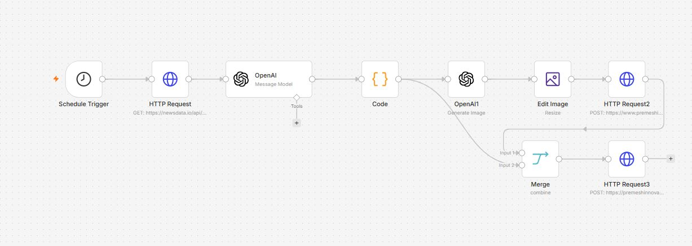

# Create & Publish Blog Post on WordPress using n8n

## Overview

This n8n workflow automatically generates and publishes blog posts on a WordPress website using AI.

The workflow fetches the latest technology news, generates a unique blog article using OpenAI, creates a featured image, uploads the image to WordPress, and publishes the article automatically.

This automation eliminates manual content creation and publishing efforts while ensuring a consistent flow of fresh content.

---

## Workflow Screenshot

---

## Features

- Automatic scheduled execution
- Fetch latest technology news
- AI-powered blog generation
- Automatic featured image generation
- Image resizing for blog compatibility
- Upload image to WordPress Media Library
- Publish post automatically
- Assign featured image automatically
- Fully automated content pipeline

---

## Use Cases

### Content Marketing

Automatically publish trending technology articles.

### SEO Blogging

Generate regular blog content to improve website visibility.

### News Websites

Repurpose trending news into unique blog articles.

### Agency Automation

Manage multiple client blogs with minimal manual effort.

### Personal Blogs

Maintain a consistently active blog.

---

## Workflow Architecture

Schedule Trigger
↓
Fetch Technology News
↓
Generate Blog Content
↓
Parse AI Response
↓
Generate AI Image
↓
Resize Image
↓
Upload Image to WordPress
↓
Merge Content + Media ID
↓
Publish Blog Post

---

## Workflow Nodes

### 1. Schedule Trigger

Node Type:
Schedule Trigger

Purpose:
Starts the workflow automatically at a configured time.

Configuration:

- Runs once daily
- Configured execution hour: 9 AM

Expected Output:

Triggers workflow execution.

---

### 2. HTTP Request (Fetch News)

Node Type:
HTTP Request

Purpose:

Retrieves latest technology news articles.

Method:

GET

API Endpoint:

https://newsdata.io/api/1/news

Query Parameters:

| Parameter | Value |
|------------|---------|
| apikey | YOUR_NEWSDATA_API_KEY |
| category | technology |
| language | en |

Output:

Returns latest technology news articles.

Example:

{
  "title": "AI Startup Raises Funding",
  "description": "A new AI startup has secured..."
}

---

### 3. OpenAI (Blog Generator)

Node Type:
OpenAI Chat Model

Purpose:

Converts news content into an original blog article.

Model:

GPT-4o

Input:

News title and description.

Prompt Responsibilities:

- Generate unique title
- Create 5 HTML paragraphs
- Avoid plagiarism
- Add analysis
- Create conclusion
- Return valid JSON

Output Example:

{
  "title": "How AI Startups Are Reshaping Innovation",
  "content": "
...
"
}

---

### 4. Code Node

Node Type:
Code

Purpose:

Parses JSON returned by OpenAI.

Operations:

- Extract title
- Extract content
- Create clean JSON structure

Output:

{
  "title": "...",
  "content": "..."
}

---

### 5. OpenAI Image Generation

Node Type:
OpenAI Image

Purpose:

Generate a blog featured image.

Prompt Source:

Generated title +
First portion of blog content

Example Prompt:

Create a professional illustration showing advancements in artificial intelligence and modern technology.

Output:

Generated image file.

---

### 6. Edit Image

Node Type:
Edit Image

Purpose:

Resize image before uploading.

Configuration:

Width: 1340 px

Height: 638 px

Benefits:

- Consistent blog appearance
- Optimized WordPress display
- Social sharing compatibility

Output:

Resized image.

---

### 7. HTTP Request (Upload Media)

Node Type:
HTTP Request

Purpose:

Uploads image to WordPress Media Library.

Method:

POST

Endpoint:

https://your-wordpress-site.com/wp-json/wp/v2/media

Authentication:

WordPress API

Headers:

Content-Disposition:
attachment; filename=image.png

Output:

{
  "id": 123
}

Media ID is later used as featured image.

---

### 8. Merge

Node Type:
Merge

Purpose:

Combines:

- Blog content
- Uploaded image ID

Result:

Single payload ready for publishing.

---

### 9. HTTP Request (Publish Post)

Node Type:
HTTP Request

Purpose:

Publishes blog post.

Method:

POST

Endpoint:

https://your-wordpress-site.com/wp-json/wp/v2/posts

Body:

{
  "title": "...",
  "content": "...",
  "status": "publish",
  "featured_media": 123
}

Output:

Published WordPress article.

---

## Required Credentials

### OpenAI

Required:

- OpenAI API Key

Used For:

- Blog generation
- Image generation

---

### NewsData API

Required:

- NewsData API Key

Used For:

- Fetching latest news

---

### WordPress

Required:

- Website URL
- Username
- Application Password

Used For:

- Media uploads
- Blog publishing

---

## Installation

### Step 1

Import workflow.json into n8n.

### Step 2

Create OpenAI credential.

### Step 3

Add your OpenAI API key.

### Step 4

Create NewsData API key.

### Step 5

Update HTTP Request node.

Replace:

YOUR_NEWSDATA_API_KEY

with your actual key.

### Step 6

Create WordPress credential.

### Step 7

Generate Application Password inside WordPress.

### Step 8

Update WordPress URLs.

Replace:

https://your-wordpress-site.com

with your website.

### Step 9

Run workflow manually.

### Step 10

Enable workflow.

---

## Customization

### Change News Category

Examples:

- business
- sports
- health
- entertainment
- science

### Change Posting Frequency

Modify Schedule Trigger.

Examples:

- Every hour
- Daily
- Weekly

### Improve Blog Length

Update OpenAI prompt.

Example:

Generate 1000-word article.

### Add SEO Keywords

Inject keywords into prompt.

### Publish Draft Instead

Change:

publish

to:

draft

---

## Troubleshooting

### OpenAI Error

Cause:

Invalid API key.

Solution:

Verify credential configuration.

---

### WordPress Authentication Error

Cause:

Invalid Application Password.

Solution:

Generate new Application Password.

---

### No News Returned

Cause:

API quota exceeded.

Solution:

Upgrade NewsData plan or retry later.

---

### Image Upload Failure

Cause:

WordPress upload restrictions.

Solution:

Increase upload size limit.

---

## Technologies Used

- n8n
- OpenAI GPT-4o
- OpenAI Image Generation
- NewsData API
- WordPress REST API
- JavaScript

---

## Future Improvements

- SEO metadata generation
- Auto category assignment
- Auto tag assignment
- Social media posting
- Multi-language support
- Internal linking generation
- Newsletter integration

---
